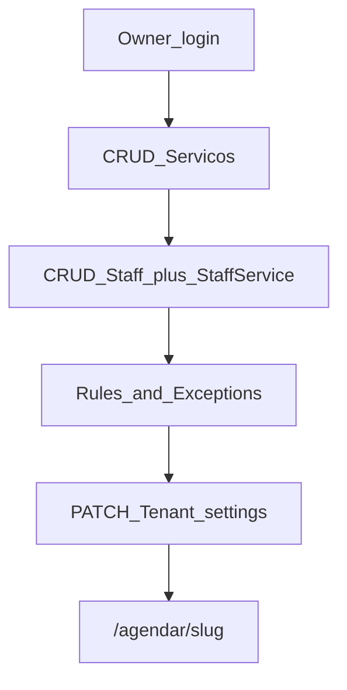

# Trato — Roadmap SaaS (fases A → B → C)

Gerado a partir do inventário real do repo. Não reescreve booking/agenda.

---

## Fase A — Gestão operacional na UI

**Objetivo:** o OWNER configura equipe, serviços, horários e políticas sem tocar no DB.

### User stories
1. Como dono, crio/edito/desativo barbeiros e associo quais serviços cada um faz.
2. Como dono, crio/edito/desativo serviços (nome, duração, preço).
3. Como dono, defino horários semanais e folgas/exceções por barbeiro.
4. Como dono, ajusto nome, marca, políticas de slot/lead e depósito/PIX básico.
5. Como dono, vejo empty states claros quando falta equipe/serviço/horário.

### Escopo IN
- `/app/equipe`, `/app/servicos`, `/app/configuracoes` (+ horários embutidos na equipe)
- APIs `/api/app/staff`, `/api/app/services`, `/api/app/settings` (+ rules/exceptions)
- Zod em `src/lib/validations/owner.ts`
- Nav lateral atualizada

### Escopo OUT
- Signup/onboarding, billing, invites STAFF, Location multi-unidade
- Edição de `asaasApiKeyEnc` em texto puro sem criptografia dedicada (campo opcional mascarado / só set)
- Redesign da landing / Dom Carlos

### Superfície
| Área | Arquivos |
|------|----------|
| Páginas | `src/app/app/(dashboard)/equipe/page.tsx`, `servicos/page.tsx`, `configuracoes/page.tsx` |
| Boards | `src/components/app/staff-board.tsx`, `services-board.tsx`, `settings-form.tsx` |
| APIs | `src/app/api/app/staff/route.ts`, `staff/[id]/route.ts`, `staff/[id]/rules/route.ts`, `staff/[id]/exceptions/route.ts`, `services/route.ts`, `services/[id]/route.ts`, `settings/route.ts` |
| Nav | `src/components/app/app-nav.tsx` |
| Validação | `src/lib/validations/owner.ts` |

### Schema / migrations
Nenhuma — modelos já existem.

### Fluxo



### Riscos
- Soft-delete vs hard-delete: preferir `INACTIVE` / `isActive: false` se houver bookings.
- Staff sem rules → zero slots públicos (empty state + aviso).
- Cross-tenant: sempre `where: { id, tenantId }`.
- `StaffService.tenantId` denormalizado obrigatório no insert.

### Critério de aceite
OWNER logado altera serviços/equipe/horários/config e o `/agendar/{slug}` reflete sem seed/SQL.

### Estimativa
**L** — depende de: auth + schema existentes (ok).

---

## Fase B — Provisionamento de tenant

**Objetivo:** outra barbearia entra sem SQL manual e sai com WhatsApp pronto para operar.

### User stories
1. Landing “Começar” → nome, slug, email, senha → Tenant + OWNER + defaults mínimos.
2. Slug único validado (citext), feedback se ocupado.
3. **WhatsApp self-serve:** OWNER conecta número via QR Code / pairing na área `/app/whatsapp`.
4. Pós-signup: sessão + redirect checklist (`/app/whatsapp` ou `/app/servicos`).
5. (B.1) Super-admin lista/cria tenants se self-serve for adiado.

### Escopo IN
- `/comecar` ou CTA na home → form onboarding
- `POST /api/auth/signup` (ou `/api/onboarding`)
- Seed mínimo: 1 serviço placeholder opcional OU empty state guiado (Fase A cobre o resto)
- `isActive: true`, `plan: trial`, `trialEndsAt = now() + 30 dias`
- Mensagem de boas-vindas (WhatsApp via uazapi ou e-mail) com link `/agendar/{slug}` + `/app/login`
- `/app/whatsapp`: criar/conectar instância uazapi, exibir QR Code, status e número; salvar `waInstanceId` no Tenant
- Templates de mensagem básicos + toggles de notificação (B3)

### Escopo OUT
- Pagamento de assinatura, custom domain

### Escolha
**Self-serve primeiro** (B) com WhatsApp self-serve **incluído** — sem isso o onboarding não entrega lembretes/confirmação autônomos. Super-admin (B.1) só se abuso/spam exigir gate.

### Schema / migrations
- `Tenant.trialEndsAt` + `Tenant.trialStartedAt`
- `MessageTemplate` (por tenant, keys: booking_created, reminder_24h, reminder_2h, cancel, feedback)
- `NotificationPreference` (por tenant, toggles por evento)

### Critério de aceite
Barbearia nova completa signup, conecta WhatsApp via QR, recebe boas-vindas com links, configura via Fase A e publica `/agendar/{slug}`.

### Estimativa
**L** — depende de Fase A + admin/instance uazapi.

---

## Fase C — Hardening SaaS

**Objetivo:** cobrar ou cortar tenant; operação sem Prisma Studio.

### User stories
1. Plano/gating por `Tenant.plan` + `isActive`.
2. Checkout ou registro manual de assinatura (Asaas/Stripe).
3. Invites OWNER/MANAGER opcional.
4. Logs/alertas básicos de falha WA/PIX.

### Escopo OUT
- App mobile nativo, AI WhatsApp agent, multi-Location UI.

### Critério de aceite
Tenant inadimplente pode ser desativado; limites starter documentados e enforced.

### Estimativa
**L** — depende de A + B.

---

## Fase D — Engajamento e operação avançada

**Objetivo:** aumentar retenção e receita do tenant depois de operar o básico.

### Escopo
- `/app/campanhas` — segmentos (nunca atenderam, inativos, aniversariantes), preview, disparo WhatsApp em massa
- `/app/relatorios` avançado — período, agendamentos, faturamento, ticket médio, status, novos vs recorrentes
- `/app/mensalistas` — pacotes/assinaturas de clientes (serviços incluídos, limite, validade, status)
- `/app/temas` — presets visuais + logo + cor na página pública
- Biblioteca de mídias — `Service.imageUrl` + storage (Supabase Storage/S3)

### Estimativa
**M–L** por item — só depois de A/B/C estáveis.

---

## Checklist de PRs

1. **PR-A1** — validations + APIs services/staff/settings
2. **PR-A2** — UI serviços + equipe (com rules/exceptions) + nav
3. **PR-A3** — UI configurações + empty states / aceite manual
4. **PR-B1** — signup + `/comecar` + trial 30d + mensagem de boas-vindas
5. **PR-B2** — `/app/whatsapp` com QR Code / pairing e status (uazapi)
6. **PR-B3** — templates de mensagem + toggles de notificações
7. **PR-C1** — billing/gating + expiração de trial
8. **PR-D1** — campanhas ou resumos avançados ✅
9. **PR-D2** — mensalistas ✅
10. **PR-D3** — temas + biblioteca de mídias ✅ (URL de logo/imagem; upload Storage depois)

## Continua manual na Fase A
- Criar instância WhatsApp (uazapi) e colar `waInstanceId`
- Chave Asaas do tenant (se depósito)
- Criar o Tenant + OWNER inicial (até Fase B)

---

## Backlog — evoluções candidatas (fase a definir)

Itens capturados fora do escopo A→B→C atual. **Não estão alocados a nenhuma fase.** Antes de implementar, fazer um estudo curto de encaixe (dependências, valor vs risco, se vira A.x / B.x / C.x ou fase D).

### Perfil e identidade do tenant (área do dono)
- Aba/seção de perfil: foto/logo (upload usável, não só URL), endereço, aparência (marca), e troca de senha do OWNER
- Separar mentalmente “conta” (e-mail/senha) de “salão” (logo, endereço, brand) se a UX pedir
- Hoje `/app/configuracoes` já cobre parte disso (nome, endereço, cor, `logoUrl`); falta polish de mídia + senha

### Relatórios avançados
- Gráficos de pico de horários
- Clientes com mais agendamentos (top clientes)
- Outros gráficos pertinentes (ex.: serviço mais vendido, no-show por dia) — lista final no estudo
- Parte de `/app/relatorios` já existe (volume, faturamento, ocupação, faltas); isto é incremento de analytics

### Critério para alocar fase
1. Dependências técnicas (storage de imagem, auth password change, agregações SQL)
2. Valor para o tenant atual vs. crescimento SaaS (B/C)
3. Não atrasar provisionamento (B) nem billing/gating (C) sem decisão explícita

### Backlog — engajamento (fora de D até demanda real)
- Programa de fidelidade (pontos por agendamento, resgate)
- Vale-presente / gift cards
- Biblioteca de mídias (storage + `Service.imageUrl`; galeria pública vs upload por serviço)

---

## Prompt curto — implementar só Fase A (Agent)

```text
Implemente SOMENTE a Fase A do ROADMAP_SAAS.md no repo Trato.

IN: CRUD owner de /app/servicos, /app/equipe (staff + StaffService + AvailabilityRule + AvailabilityException), /app/configuracoes (campos seguros do Tenant). APIs /api/app/* com requireOwnerApi e filtro tenantId. Zod em src/lib/validations/owner.ts. Atualizar app-nav. Soft-deactivate em vez de hard-delete se houver bookings. UI no padrão customers-board (Tailwind + CSS vars, PT-BR, mobile-first). Sem migration nova.

OUT: signup, billing, invites, Location, redesign landing, reescrever agenda/booking.

Aceite: OWNER configura tudo pela UI e /agendar/{slug} reflete. Não edite ROADMAP_SAAS.md.
```
